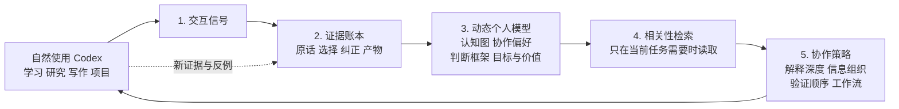

# Codex Personal Memory Engine

> 不是让 AI “记住更多对话”，而是让它在长期协作中，逐步学会**怎样更好地和你一起思考、学习与工作**。

你不应该每天维护一份“我的偏好 / 我的知识水平 / 我的价值观”表格。理想的 Codex 应该从你自然的学习、研究、写作、项目实践和反馈中，逐步建立一份可纠错的协作画像：

- 哪些概念你已经能用于判断，不必每次从定义讲起；
- 哪些概念你只见过术语，需要从真实场景和因果链补桥；
- 你如何要求证据、区分事实与推断、做产品取舍；
- 你希望它怎样组织信息、验证结论、推进项目；
- 哪些目标、项目状态与决策原则会影响下一次协作。

**Codex Personal Memory Engine** 是实现这一愿景的 Starter Kit：它把自然交互转成可追溯证据，再转成可被反驳的动态假设，最后才在合适的范围内改变未来协作方式。



## 它最终想带来的体验

假设你一直在用 Codex 做 AI PM 学习和项目：

| 没有个人记忆系统 | 有经过审查的个人记忆系统 |
| --- | --- |
| 每次都要重复说明“我要来源、事实和推断分开”。 | Codex 默认先给证据边界；但当前任务要求快结论时，仍以当前要求为准。 |
| 已经能用于产品判断的概念，也被反复讲基础定义。 | Codex 从你已经展示过的应用能力继续讲，只补新的场景、取舍和边界。 |
| 第一次提出新概念时，AI 可能直接堆术语。 | Codex 知道这项能力尚未观察，先用真实问题和因果链搭一个最小桥梁。 |
| 你每次需要手动重述项目目标、协作方式和纠正过的错误。 | Codex 把反复出现、会改变未来协作的信号形成候选，并让你能随时纠正。 |

它不是“更会迎合你”的聊天机器人，也不是对用户下人格结论。它是一个**可审查的长期协作系统**：让 AI 对“你正在做什么、你已经理解到哪里、下一步怎样帮你最有效”形成有证据的工作假设。

## 五层展示视图，五层底层闭环

视频里常见的“五层记忆系统”适合作为用户理解它的展示视图；本项目不把它误做成五层静态数据库，而把它实现为持续闭环。

| 展示层 | 系统真正记录的内容 | 它可以怎样改变协作 |
| --- | --- | --- |
| 1. 当下任务与项目 | 当前目标、约束、已做决策、项目状态 | 少重复背景，先处理未决问题 |
| 2. 协作方式 | 对来源、结构、验证、交付形式的可见偏好 | 调整信息组织与查证顺序 |
| 3. 认知地图 | 对具体概念的认识、因果解释、辨析、应用证据 | 不重复已掌握的基础；为未知概念补最小桥梁 |
| 4. 判断框架与价值假设 | 跨场景反复出现的取舍原则与反例 | 在提出方案时展示更相关的权衡，而非替用户决定 |
| 5. 长期协作策略 | 经审查后、确实能改善未来工作的高置信假设 | 轻量调整教学深度、工作流和提醒方式 |

底层闭环是：

```text
证据账本 → 动态画像假设 → 相关性检索 → 协作策略 → 新证据与反例
```

只有“未来确实可能改变 Codex 行为”的信息才值得进入这个闭环。

## 为什么它敢于推断，又不擅自定义你

真正的个性化不能只让用户手工编辑，也不能让模型随口猜测。本项目采用三段式状态：

| 状态 | 含义 | 对回答的影响 |
| --- | --- | --- |
| `candidate` | 单条或弱证据形成的候选结论 | 不影响回答，只进入审查 |
| `active_hypothesis` | 至少两条独立证据、无强反证、范围明确 | 只轻量调节解释深度、组织和验证顺序 |
| `confirmed_principle` | 用户确认或长期、高一致性证据支持 | 在明确范围内参与协作策略 |

因此：

- 问一个问题，不等于“不懂”；
- 一句“这次简短一点”，不等于长期偏好；
- 当前请求永远优先于过去画像；
- 反例会降低置信度或保留冲突，而不是被悄悄忽略；
- 不推断诊断、敏感属性或宽泛人格标签。

## 先影子运行，再进入软个性化

“影子模式”不是项目目标，而是防止系统一开始就误导你的启动阶段。

```text
影子运行：采集与归纳，但不改变回答
      ↓ 审查误判、缺失和反例
软个性化：只有高可信、范围明确的假设轻量影响协作
      ↓ 用重复背景次数、用户纠正次数、无用基础解释等指标评估
扩大使用：持续保留当前请求优先与人工纠错入口
```

当前 Starter Kit 默认停在影子模式。它已提供采集 Hook、数据契约、推断 Skill、候选状态与评测题；是否、何时让已审查假设影响回答，应该由每位使用者明确决定。

## 项目组成

| 目录 | 它在闭环中的作用 |
| --- | --- |
| `hooks/` | 记录用户输入与最终回复的最小必要事件；不调用模型、不改变回答 |
| `skill/` | 将 inbox 转成证据、候选画像、反证与审查报告 |
| `templates/` | 私有运行时目录、五类画像、schema 和影子评测题的空模板 |
| `config/` | 明确限制采集范围的示例配置 |
| `scripts/` | 本地安装与结构校验脚本 |

## 安装（本地、透明、可撤销）

1. 克隆仓库后，在其根目录运行：

   ```bash
   ./scripts/install-local.sh
   ```

2. 编辑 `~/.codex/personal-memory/config.json`，把 `workspace_scope` 改成你希望采集的**一个具体工作区绝对路径**。没有这个配置，Hook 会安全地不采集。

3. 重启 Codex，打开 `/hooks` 审查并信任 `UserPromptSubmit` 与 `Stop`。

4. 在 Codex 中正常工作；Hook 只把新消息写进 `~/.codex/personal-memory/private-inbox/`。

5. 需要归纳时，让 Codex 使用 `$personal-memory-engine`。它会生成候选与审查报告；影子模式中不得更新 `active-profile.md`。

运行 `./scripts/verify-install.sh` 可检查配置与数据结构。删除 `~/.codex/hooks.json` 中对应的两项 Hook，并移走 `~/.codex/personal-memory/`，即可停止和移除该系统。

## 隐私与安全

- 不上传 `~/.codex/personal-memory/`；它包含真实对话、证据和个人画像。
- Hook 在写入前对常见 API key、Bearer token、密码/密钥赋值做基础脱敏；这不是完整的秘密扫描器。
- 只对 `workspace_scope` 内的会话工作目录采集。
- Hook 不调用模型、不读取旧 transcript、不修改项目文件，也不向模型返回额外上下文。

## 公开发布检查

公开 fork 或二次开发前，请运行：

```bash
git status --ignored
git check-ignore -v private-inbox/example.jsonl evidence/events.jsonl runtime/active-profile.md
./scripts/verify-install.sh
```

确认仓库中没有真实 JSONL、用户名、绝对私有路径、令牌或个人画像。
